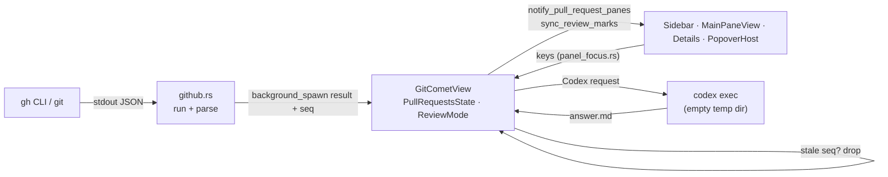

# PR mode: developer reference

How gGit's GitHub pull request mode is built: where its state lives, every call it makes to
GitHub, how review mode and the reviewer agents work, and what to keep in mind when changing it.

User-facing keys are in [shortcuts.md](shortcuts.md) (the Pull requests tab, Review mode, Codex
and Reviewer menu sections); this document links to them instead of repeating them. Paths are
relative to `crates/gitcomet-ui-gpui/src/` unless they start with `crates/` or `docs/`. Code is
named by symbol, never by line number.

## 1. Overview

PR mode is the Sidebar's **Pull requests** tab and everything it opens:

| Surface | Where | What |
| --- | --- | --- |
| PR list | Sidebar (panel 1) | Open pull requests, ranked as an inbox, stacks grouped |
| PR view | Middle (panel 2) | The selected PR's Conversation and Comments tabs; replaces History |
| PR facts | Details (panel 3) | State, checks, merge, size, Reviewers, Stack, Commits |
| Review mode | 1 Files, 2 Diff, 3 Your review | Reading the PR file by file, line comments kept as a local draft, submitted as one review |
| Reviewer agents | Menu on `i`, results in the Codex panel (0) | Codex runs over the PR with the repository's `.reviewer/` rules |

Ground rules that hold everywhere:

- **All GitHub I/O goes through the `gh` CLI.** There is no HTTP client and no token handling;
  `gh` owns authentication. Local repository work uses `git` (and gix through the backend).
- **github.com only.** `GH_HOST` is removed and every call names `github.com`. GitHub Enterprise
  is not supported.
- **PR state is view state.** It lives on the root view (`GitCometView`), not in
  `gitcomet-state`; the reducer never reads it. The few shared pieces are listed in the code map.
- **GitHub text is untrusted.** Markdown renders with remote images off and no raw HTML; text sent
  to Codex sits inside a data fence; values reach `gh`/`git` only after validation.
- **Keyboard-first.** Every action has a key (repository rule, `AGENTS.md`).



## 2. Code map

| Path | Responsibility |
| --- | --- |
| `github.rs` | Every `gh` and PR-related `git` call, the response types and parsers, stack logic, limits |
| `view/pull_requests.rs` | `PullRequestsState`, loading and refresh, inbox order, stacks in the UI, create / checkout / merge / submit flows, PR view scrolling |
| `view/review.rs` | `ReviewMode`, the on-disk `ReviewDraft`, review keys (`handle_review_key`), viewed marks, `L`, commit ranges and the commit picker, Codex suggestions |
| `view/panes/main/pull_request.rs` | Panel 2 PR view: Conversation, Comments, `PrMarkdownCache` |
| `view/panes/main.rs` | `MainPaneSurface`: which surface panel 2 shows |
| `view/panes/main/review_cursor.rs` | Review line cursor, `ReviewCommentScope`, comment anchoring |
| `view/panes/details.rs` | `pull_request_details_view` (PR facts, Stack, Commits) and `review_panel_view` (Your review) |
| `view/panes/sidebar.rs` | `render_pull_requests_content` (PR list) and `render_review_files_content` (review Files, flat or tree) |
| `view/pr_symbols.rs` | State/review/check glyphs, kind tag from the title prefix |
| `view/permalink.rs` | `github_remote`, `github_slug`: which remote is GitHub |
| `view/panels/popover/` | `create_pull_request_prompt.rs`, `merge_pull_request_prompt.rs`, `pull_request_review_prompt.rs`, `review_comment_prompt.rs` |
| `view/panel_focus.rs` | Key routing (`handle_panel_key`, `handle_pull_request_key`), `key_hints`, `key_help`, the PR legend |
| `codex.rs` | Running `codex exec`, the prompt and data fence |
| `reviewer.rs` | `.reviewer/` parsing, answer JSON shapes, diff helpers |
| `view/reviewer_menu.rs` | The PR `i` menu: scopes, actions, trusted base commit |
| `view/codex_panel.rs` | Panel 0, the plain Codex menu, `Material` / `gather`, `dispatch_codex`, `finish_codex` |
| `view/state_apply.rs` | Watches `last_branch_push` for push-and-create |

Shared with the rest of the app:

- `gitcomet-state`: `SidebarMode::PullRequests`; `RepoState.last_branch_push` (a push's outcome);
  `Msg::PushBranch`, `Msg::ReloadRepo`, `Msg::SelectDiff` / `Msg::ClearDiffSelection`;
  `session::review_drafts_dir`.
- `gitcomet-core`: `DiffTarget::CommitRange { from_commit_id, to_commit_id, path }`, which is how
  review mode shows a file (History's commit-range file list uses it too; in PR mode only
  `review_open_file` dispatches it); `generated_files.rs` (the built-in generated
  list). The gix backend implements `generated_file_paths_at_commit`
  (`crates/gitcomet-git-gix/src/repo/generated_files.rs`).

## 3. State model

### On the root view

`GitCometView` (fields declared in `view/mod_helpers/mod.rs`) holds:

- `pull_requests: PullRequestsState`, a map from `RepoId` to `RepoPullRequests`.
- `review: Option<ReviewMode>`: **one review per window**, across repositories. Starting a review
  in another repository replaces it (its draft stays on disk).
- `commit_scope_picker: Option<CommitScopePicker>` (review mode's commit picker overlay),
  `review_plan_cache` (the Files flat/tree plan), `reviewer_menu`, `reviewer_cache`,
  `pending_reviewer_ask`.

### `RepoPullRequests` (`view/pull_requests.rs`)

- List: `list: PrLoad<Arc<Vec<PullRequestSummary>>>`, `stacks`, `native_stacks`, `selected`.
- Selected PR: `detail`, `threads`, `last_review`, `diff_base` (the merge base),
  `generated_files`, file paging (`file_pages`, `next_file_page`, `file_page_count`,
  `files_error`).
- Panel 2 and Details view state: `content_tab: PrContentTab`, `selected_entry`,
  `selected_thread`, `show_hidden_threads`, `commit_selection: PrCommitSelection`.
- Dialogs: `submitting`, `submit_error`, `awaiting_push`, `checking_out`; `drafts` (pending comment
  count per PR, for the list badges).

`PrLoad` is `Idle | Loading | Ready | Failed`.

**Stale results.** Each `RepoPullRequests` load has its own counter (`list_seq`, `detail_seq`,
`threads_seq`, `last_review_seq`, `diff_seq`, `files_seq`, `generated_files_seq`). A load captures
the value when it starts; a result that comes back with an older value, or for a PR that is no longer
`selected`, is dropped. Review-mode loads use a global `next_seq()` instead (`since_seq`,
`viewed_seq`, `CommitReviewRange.seq`), hunk ranges use `hunk_key`, and `load_review_threads` only
checks the repository and PR number. Nothing is cancelled (file-page lanes do stop on their own,
`still_wanted`), so keep one of these checks when adding a load.

### `ReviewMode` (`view/review.rs`)

- Files: `files`, `all_files`, `file_ix`; the filters `query`, `show_viewed`, `generated`,
  `show_generated`, `generated_placeholder_dismissed`, `sidebar_dir_cursor`.
- The draft: `draft: ReviewDraft` (saved on disk, see 8.2); Your review: `selected_comment`,
  `armed_delete`.
- Head and cursor: `head_moved`, `pending_jump`, `needs_cursor`.
- GitHub threads and Codex suggestions: `threads`, `suggestions`, `suggestion_generation`.
- Changes since your last review: `since_review: Option<SinceReview>`, `since_base_oid`,
  `only_changed`. Commit range: `commit_range: Option<CommitReviewRange>`.
- Viewed sync: `viewed_sync: ViewedSync`, `dismissed`, `confirmed`, `was_dismissed`,
  `viewed_pushing`.
- Commentable lines: `hunk_ranges`, `hunk_key`.

### Panes and how they are fed

The panes are cached gpui views; a change to PR state reaches them explicitly:

- `notify_pull_request_panes` notifies the Sidebar, Details and main panes, the popover host
  (deferred, since it can run inside the host's own handler) and the root.
- `sync_review_marks` copies the review's gutter marks, `ReviewCommentScope` and the
  generated-placeholder flag into `MainPaneView` (`review_marks`, `review_thread_marks`,
  `review_suggestion_marks`, `review_comment_scope`, `review_generated_placeholder`).
- `MainPaneView.review_active` is set by `start_review`, `leave_review` and `finish_review`, and
  `review_after_render`, which runs every frame, keeps it in step with `active_review()`.
  `review_after_render` also reopens the file when the diff base moved, starts the hunk-range load,
  and places the first cursor or a `pending_jump`.
- `MainPaneView.pull_request_shown` records whether the last render showed the PR view, so key
  routing (which runs inside the root's own update) can ask without reading the root.

Pane-local state: `MainPaneView` (`pull_request_scroll`, `pull_request_scroll_key`,
`pr_markdown_cache`), `DetailsPaneView` (`pr_details_scroll`, the shared flat/tree collapse store
under `FileListId::Review`), `SidebarPaneView` (`review_query_input`, `review_files_scroll`,
`review_rows`, `review_file_counts`), `PopoverHost` (dialog inputs, `pull_request_draft`,
`pull_request_push_first`, `pull_request_delete_branch`, `review_comment_unsaved`).

### When PR mode is "on"

- `pull_request_details_active()`: the PR tab shows and a PR is selected.
- `pull_request_content_active()`: the same, and no review is active. Panel 2 shows the PR view.
- `active_review()`: a review exists for the active repository and the PR tab shows.
- `diff_is_open()` is false while PR content is active, so diff keys stay out of the PR view.

## 4. The GitHub layer (`github.rs`)

### Running `gh`

`gh()` builds every command with `background_command("gh")` (no console window on Windows),
removes `GH_HOST`, and sets `GH_PROMPT_DISABLED=1`, `GH_NO_UPDATE_NOTIFIER=1`, `GH_PAGER=""`,
`NO_COLOR=1`, `CLICOLOR=0`. `pr` subcommands pass `--repo=github.com/{slug}`; `api` calls pass
`--hostname=github.com`. `run()` captures stdout and stderr. **There is no timeout and no
cancellation**: each view load runs in `cx.background_spawn` and relies on the seq check (section 3)
to drop stale answers.

Which repository: `permalink::github_remote` picks the `upstream` remote, then `origin`, then any
other github.com remote. Its owner is "the repository's owner" for stack eligibility.

### Reads

| Function | Call | When |
| --- | --- | --- |
| `list_open` | `gh pr list --repo=… --state=open --limit=100 --json=number,title,author,headRefName,headRepositoryOwner,baseRefName,isDraft,isCrossRepository,reviewDecision,statusCheckRollup,reviewRequests,latestReviews,updatedAt` | `refresh_pull_requests`; then the same with `--search=review-requested:@me`, in parallel with `viewer_login` |
| `viewer_login` | `gh api --hostname=github.com user` (`.login`) | Each list load and `last_review`; not cached, so `gh auth switch` is picked up |
| `native_stacks` | `gh api graphql` with one aliased `pullRequest(number){ stack { number entries(first: 50) { nodes { position pullRequest { number } } } } }` per PR | Inside the list's own load (`compute_stacks_and_native`, so the list waits for it), only for PRs already in a base-branch chain; `gh` failures are logged, bad JSON ignored |
| `view` | `gh pr view N --repo=… --json=number,title,body,url,author,createdAt,headRefName,headRefOid,baseRefName,baseRefOid,isDraft,isCrossRepository,state,reviewDecision,mergeable,additions,deletions,changedFiles,files,statusCheckRollup,comments,reviews,reviewRequests,latestReviews,commits` | Selecting a PR (200 ms debounce); `reload_pull_request` |
| `review_rest_ids` | `gh api … repos/{slug}/pulls/{n}/reviews?per_page=100 --paginate --slurp` | Alongside `view`, to match conversation reviews to REST review ids; optional |
| `last_review` | `viewer_login`, then the same reviews call | After details land; at review start if missing |
| `list_review_threads` | `gh api … repos/{slug}/pulls/{n}/comments?per_page=100 --paginate --slurp`, then `review_thread_statuses` | After details land; at review start |
| `review_thread_statuses` | `gh api graphql --paginate` with `REVIEW_THREAD_STATUSES_QUERY` (`reviewThreads { isResolved isOutdated comments(first: 1) { databaseId } }`) | Inside the thread load; optional |
| `pull_request_files_page` | `gh api … repos/{slug}/pulls/{n}/files?per_page=100&page={p}` | After details land when `changedFiles` > 100; 6 lanes (`FILE_PAGE_LANES`), each page retried after 1 s and 3 s |
| `viewed_states` | `gh api graphql --paginate` with `VIEWED_STATES_QUERY` (`files { path viewerViewedState }`) | Review start; head moves |
| `diff` | `gh pr diff N --repo=… --color=never` | Plain Codex whole-PR material: `Alt+G`, and `i p` only from another Sidebar tab while a PR is still selected (on the PR tab `i` opens the reviewer menu) |

### Writes

| Function | Call | From |
| --- | --- | --- |
| `review` | `gh pr review N --repo=… --comment\|--approve\|--request-changes [--body-file=-]` | Submit with no line comments, including the quick verdict (`Shift+S` outside review) |
| `create_review` | `gh api … repos/{slug}/pulls/{n}/reviews --method=POST --input=-`, payload `{commit_id, event, body?, comments: [{path, side, line, body, start_side?, start_line?}]}` | Submit with line comments; `commit_id` is the draft's head |
| `reply_to_thread` | `POST repos/{slug}/pulls/{n}/comments/{root_id}/replies` `{body}` | After the review, one per pending reply; stops at the first failure |
| `set_file_viewed` | GraphQL `markFileAsViewed` / `unmarkFileAsViewed(input: {pullRequestId, path})` | `space` in review mode |
| `merge` | `gh pr merge N --repo=… --merge\|--squash\|--rebase --match-head-commit={oid} [--delete-branch]` | Merge dialog |
| `merge_stack` | `PUT repos/{slug}/pulls/{n}/merge-async` `{merge_method, sha}`, then `GET …/merge-async/{uuid}` until done | Merge dialog on a native stack |
| `checkout` | `gh pr checkout N --repo=… [--branch=pr/N]` | `space` |
| `create` | `gh pr create --repo=… --base= --head= --title= --body-file=- [--draft]` | Create dialog; never pushes |

"Pending review" in gGit always means the **local draft**; GitHub-side pending reviews are never
created. Not supported: resolving threads, editing or deleting comments, file-level comments,
closing/reopening, labels, requesting reviewers, auto-merge, closed or merged PRs in the list.

### Local git calls

All with `GIT_TERMINAL_PROMPT=0`:

- `fetch_missing`: `git fetch --quiet --no-tags --no-write-fetch-head -- <remote> <oids>`, only for
  oids `cat-file -e` can't find. Used before any diff of PR commits.
- `prepare_diff_range`: fetch, then `git merge-base` (the PR's diff base).
- `pr_hunk_ranges`: `git --literal-pathspecs diff -U3 --inter-hunk-context=0 --no-textconv base head -- path`,
  parsed into the head-side line ranges GitHub accepts comments on.
- `changes_since`: `diff --name-only --no-renames --no-ext-diff -z` and `rev-list --count` (for `L`).
- `commit_range_changes`: `rev-parse oldest^`, `diff`, `log --first-parent --no-merges --name-only`.
- `default_branch`: `symbolic-ref refs/remotes/<remote>/HEAD`, else `main`, else `master`.

### Errors

`PrError` is `GhMissing` (spawn failed with not-found), `GhSignedOut` (stderr mentions
`gh auth login`) or `Failed(String)`; there is no `gh auth status` call. Where they surface:

- List: Sidebar empty states ("GitHub CLI not found", "gh isn't signed in", "Couldn't list pull
  requests").
- Details: "Couldn't load #N"; if details were already showing they stay and a toast says
  "Couldn't reload #N".
- Threads, last review, file pages: `PrLoad::Failed`, a toast, or `files_error` ("… R retries").
- Submit: `submit_error` in the dialog if it is still open, otherwise a toast.
- `api_post` prefers GitHub's JSON `message` / `errors` over stderr.

### Data types

- `PullRequestSummary` (a list row): number, title, author, head, head owner, base, draft,
  cross-repository, `review: Option<ReviewDecision>`, `checks: ChecksSummary`, `review_requested`
  (from the `@me` search), `is_mine`, `updated_at`.
- `ReviewDecision` is `Approved | ChangesRequested | ReviewRequired | Commented`. GitHub's
  `reviewDecision` wins; otherwise `from_reviews` derives it from `reviewRequests` and
  `latestReviews`, ignoring the author's own reviews and reviewers asked again. `Commented` is
  gGit's own.
- Checks: a commit status is passing on `SUCCESS`, pending on `PENDING`/`EXPECTED`; a check run is
  pending until `COMPLETED`, passing on `SUCCESS`/`NEUTRAL`/`SKIPPED`; anything else fails.
- `PullRequestDetail`: everything `gh pr view` returns, plus `conversation`, `reviewers`,
  `commits` (newest first) and `check_runs` (failing first). `mergeable` is `Some(false)` only for
  CONFLICTING, `None` while GitHub computes it.
- `ConversationEntry`: issue comments and reviews in time order; minimized comments and PENDING
  reviews dropped; `review_id` matched to REST by author and time. `is_bare_review()` (no text, no
  verdict) shows only when a loaded thread belongs to it.
- `ReviewThread`: REST comments grouped by `in_reply_to_id`, sorted by path and line, with
  `side`, `line`, `original_line`, `is_resolved`, `is_outdated`, `diff_tail` (the last 3 hunk lines).
  If the GraphQL status query fails, outdated falls back to `line == None && original_line.is_some()`.
- `LastReview`: your latest non-pending review (dismissed counts) and its `commit_id`.

### Limits and caps

| Limit | Value | Effect |
| --- | --- | --- |
| `LIST_LIMIT` | 100 | The list never pages past it; the `@me` search can add PRs beyond |
| `MAX_LISTED_FILES` | 3,000 | Above it: no review mode, no file paging, no commit fetch; Details says to open it on GitHub. Commit ranges over 3,000 files are refused too |
| `MAX_CODEX_FILES`, `MAX_CODEX_CHANGED_LINES` | 100, 20,000 | Codex refuses larger material (section 10) |
| Conversation | 100 shown entries (bare reviews don't count), 4,000 chars per comment, 32,000 for the description | `MAX_CONVERSATION`, `MAX_CONVERSATION_BODY_CHARS`, `MAX_DESCRIPTION_CHARS` |
| Commits | What `gh pr view` lists | When the newest listed commit isn't the head (`commits_truncated`), Details says only the first N are listed; the commit picker, ranges and the "your last review" divider see only those |
| `MAX_PR_VISIBLE_THREADS` | 200 | Comments tab |
| Native stack entries | 50 | GraphQL `entries(first: 50)` |

There is no rate-limit handling beyond the 6 file-page lanes, their retries and the selection
debounce.

### Input validation

Commit ids must be full hex before `git` sees them (`github::is_object_id`, 40 or 64 chars;
Codex's `gather` has its own `is_object_id` accepting 4–64); `is_repo_slug` guards every API path
and `is_node_id` every mutation id; GraphQL numbers stay within i32 (`graphql_target`). User text
goes in as `--flag=value` or on stdin, and `--raw-field` keeps a value starting with `@` from being
read as a file. GitHub paths go after `--`; `pr_hunk_ranges` and the generated-file excludes treat
them literally (`--literal-pathspecs`, `:(exclude,literal)`), but Codex's File, Lines and thread
material pass them as ordinary pathspecs (read-only, so a glob character only widens the diff).
`native_stacks` is the one query that interpolates owner and name, after the slug check.

## 5. Load lifecycle

- **List.** Loaded lazily the first time the tab shows (`ensure_pull_requests_loaded`); again on
  `R` (shift+r), after a submit, merge or create. The old list stays on screen while it reloads.
  `R` also retries a failed diff base and failed file pages, but **does not reload the selected
  PR's details or threads**.
- **Details.** 200 ms after the selection settles (`select_pull_request`); re-selecting the same PR
  does nothing unless it failed. When details land: `last_review`, threads, file pages (unless a
  reload at the same head carries them over) and the commit fetch and merge base
  (`fetch_pull_request_commits`) start. The generated-files read
  (`fetch_pull_request_generated_files`, gix at the PR head) starts once the merge base lands, and
  again whenever a later file page adds files.
- **Draft cleanup.** Every complete list load runs `pending_review_counts_in`, which also **deletes**
  draft files that hold no comments and no unsynced marks for PRs no longer open. Keep that in mind
  when changing the draft format or list loading.
- **No polling.** Nothing reloads on a timer; the only loop is the stack-merge poll.
- **Push and create.** `state_apply` hands each new `last_branch_push` outcome to
  `pull_request_push_landed`; a dialog waiting on that push (`awaiting_push`) then creates the PR or
  reports the push error.
- **Markdown.** `PrMarkdownCache` in the main pane keeps parsed documents per PR, at most 512.

### Inbox order

`inbox_rank` puts a PR at 0 if your review is requested, 1 if you have a local draft with comments,
2 otherwise; a stable sort keeps `gh`'s order inside a rank. Sections: "Waiting for your review"
(with the `@` pill), "Your reviews in progress", "Open". A stack takes its best member's rank
(`stack_adjusted_ranks`) and is placed, bottom PR first, where that member would sit
(`apply_stack_order`). The first header shows "n new · R refresh".

## 6. Surfaces

### PR list (`view/panes/sidebar.rs`)

`render_pull_requests_content` renders empty and error states (no GitHub remote, `gh` missing or
signed out, failed, no open PRs) or `pull_request_rows`. A row: state glyph
(`pr_symbols::state`, draft titles dimmed), kind tag, title without its prefix, `#N · author ·
age` (a person icon for your own PRs), then pending-comment pencil and count, checks, review glyph
and the `@` pill. Stack members are indented by depth with a `└` connector and an `n/total` pill;
`→ base` shows on a stack's bottom PR or when root PRs target different bases.

Kind tags come from the title prefix (`pr_symbols::title`): `feat`, `fix`, `refactor`, `docs`, and
`deps` for `deps`/`chore`/`ci`/`build`; the prefix, a `!` and a scope are stripped. The legend for
these glyphs is part of the `?` list on the PR tab (`pr_legend`).

### Panel 2: the PR view (`view/panes/main/pull_request.rs`)

`MainPaneView::active_surface` decides what panel 2 shows: `PullRequest` (when
`pull_request_content_active`), then `GeneratedPlaceholder` (review on a generated file), then
`Diff`, `InteractiveRebase`, `History`. The PR view takes the History panel's focus handle, so it
is `FocusPanel::History` for key routing.

- **Header**: state, kind tag, title, `#N`, the Conversation and Comments tabs (Comments shows the
  open-thread count), Open on GitHub.
- **Conversation** (`pr_conversation`): the description card, then the entries from
  `visible_pr_entry_indexes`, "Pushed N commits" events grouped between them by commit time
  (`pr_pushed_commit_groups`), a "N line comments" footer on a review that owns threads, and the
  checks line.
- **Comments** (`pr_comments`): Open / Resolved / Outdated chips, threads grouped under file headers;
  resolved and outdated hidden until `V`. The selected thread expands (`pr_thread_card`) with its
  hunk tail and every comment.
- **Markdown**: `pr_markdown_document` parses with the markdown preview parser and renders through
  `rows::render_markdown_document` with `RemoteMarkdownImagePolicy::NeverLoad` and no view, so links
  have no handlers; remote images become "Image: alt — url" text. Parse failure falls back to plain
  text. Tab width is the default (PR text belongs to no file).
- **Scrolling**: `pull_request_scroll_key = (number, tab, selection)` scrolls the selection into
  view once; `scroll_pull_request_content` handles step (20% of the window, at least 40 px), half
  page, top and bottom. A tall item scrolls within itself before the selection moves.

### Details (`pull_request_details_view` in `view/panes/details.rs`)

Facts (state and review chips, author, branch, checks with the non-passing runs, merge state,
"N files (G generated) · +A −D"), Reviewers (alphabetical by login, each with its status glyph,
"Review requested" for a pending request), Stack
(`pull_request_stack_section`, top PR first, base branch last, the current PR highlighted), and
Commits: an "All commits" row, then one row per commit, with a "your last review" divider and dots
on newer commits. The footer button's label follows the commit selection ("Review these N
commits").

## 7. Stacks

**Built locally, always** (`compute_pull_request_stacks`): PR B sits on PR A when B's base branch is
A's head branch. Only PRs from this repository count (not `is_cross_repository`, head owner equal to
the repository owner). Members are listed depth-first from the root, children by number; a PR with
two children makes a tree, flattened into one stack. `stack_parent`, `stack_child` (lowest-numbered
child) and `stack_depth` recover the shape for `<` / `>`, the row indent, the "depth/total" pill and
the Details rail.

**Native stacks** (`compute_stacks_and_native`): after the list loads, gGit asks GitHub's GraphQL
`stack` field about chain members only. A chain is marked `native` when its member set matches a
GitHub stack exactly; `native_stack_containing` answers per PR. Native stacks change merging only.

**Merging a native stack.** `plan_stack_merge` refuses, naming the PR, when any PR below the
selected one is not loaded, not approved, a draft, or has failing or running checks (a missing review
decision is not a refusal). `merge_stack` starts `merge-async`, polls every 2 s
(`STACK_MERGE_POLL_INTERVAL`) for up to 60 s (`STACK_MERGE_TIMEOUT`), and reports "outcome is
unknown; check it on GitHub" on a timeout, three failed polls or a missing job id; GitHub's own
`failed` message is shown as is. The delete-branch toggle is hidden for native stacks.

**Plain chains** merge one PR into its own base; `base_chain_merge_note` says so ("Merges into X,
not Y") and, for the bottom PR, that deleting its branch makes GitHub retarget the next one.

## 8. Review mode

### 8.1 Starting and leaving

`r` calls `start_review`: it needs loaded details, refuses PRs over `MAX_LISTED_FILES` or with no
listed files, loads the draft, honours a Details commit selection, opens the first unviewed file,
and starts the viewed-state, thread and last-review loads. `enter` on a thread in the Comments tab
calls `start_review_at_thread`, which also queues a `pending_jump` to the thread's line (or its
`original_line`). `q` calls `leave_review`: the review is dropped, the diff cleared, the Sidebar
focused; the draft stays on disk.

Files are shown as `DiffTarget::CommitRange` diffs from the diff base to the head.

### 8.2 The draft on disk

`ReviewDraft { repo, number, head_oid, comments, viewed, viewed_head, unsynced }` is pretty JSON in
`<app data>/review-drafts/` (`session::review_drafts_dir`), named from the GitHub slug and number
(`draft_file_prefix`: characters outside `[A-Za-z0-9-_.]` become `~`, so `owner~name~42.json`).
It is keyed by the GitHub repository, not the local path: two clones of one repository share drafts.
`save_review` writes non-empty drafts off the UI thread through `write_private_file`, ordered by a
write sequence; deleting an emptied draft (and the "left while posting" path in `finish_review`)
writes synchronously. A draft that doesn't parse, or names another repository or PR, is renamed
`*.json.unreadable` and reported; an I/O error is reported without renaming. `review_drafts_dir`
returns `None` under tests, so tests never touch it. List loads also prune drafts (section 5).

A comment is `ReviewComment { anchor: ReviewAnchor { path, side, line, start }, body, reply_to }`.

### 8.3 Where comments can go

`ReviewCommentScope` (`review_cursor.rs`) sets the rules. In every scope a range must not cross a
hunk gap (`review_selection_anchor` checks it first); then:

- `Full` (the whole PR): a changed line or within 3 lines of one, matching what GitHub accepts.
- `Since` (`L`) and `Range` (a commit range ending at the head): head-side lines inside one of the
  PR's own hunks (`pr_hunk_ranges`, loaded per file by `review_load_hunk_ranges`).
- `Historical` (a range ending before the head): read-only.

`c` opens the composer (`PopoverKind::ReviewComment`); `Ctrl+Enter` adds the comment. `Esc` keeps a
new comment's unsent text in one slot (`PopoverHost.review_comment_unsaved`), restored only when the
composer reopens on the same anchor and reply target; an edit's changes are abandoned. `Alt+S` inserts a fenced `suggestion` block from the selected new-side
lines. `r` on a thread replies to it (`review_reply_at_cursor`); `r` in Your review replies to an
outdated thread, anchored on its `original_line`. Replies are posted after the review.

Others' threads come from `list_review_threads`; `t` / `T` step through threads and Codex
suggestions together. Your review lists pending comments, then "Outdated conversations".

### 8.4 Viewed marks

`space` (`review_toggle_viewed`) applies the mark locally at once, records it in `draft.unsynced`
with the current head, then sends it with `set_file_viewed`, one at a time. `ViewedSync` is `Idle |
Loading | GitHub { pr_id } | Offline`. When GitHub's states load, `merge_viewed_states` lets GitHub
win, lays unsent presses on top, and drops presses made at another head. A refused push restores the
old mark with a toast; with GitHub unreachable, marks stay local. Generated files never count toward
viewed progress.

### 8.5 Narrowing what you read

- **`L`, changes since your last review**: `changes_since(last.commit_id, head)` gives a
  `SinceReview` (changed files, or gone after a force-push, or failed). While on, the diff base is
  your last review's commit.
- **Commit ranges**: `j`/`k` and `Shift+J`/`Shift+K` in Details, then `r`; or `Shift+C` in review
  for the commit picker (`render_commit_scope_picker`, keys in `handle_commit_scope_picker_key`).
  `commit_range_changes` sets the base to `oldest^`; the files are the range's diff limited to the
  PR's files, plus files touched by first-parent commits in the range.
- **Generated files**: `linguist-generated` from `.gitattributes` at the PR head, or the built-in
  list (`BUILTIN_GENERATED_NAMES` / `SUFFIXES`: common lockfiles, `go.sum`, `*.min.js`,
  `*.min.css`). Hidden from Files until `Shift+G`; opening one shows a placeholder until `enter`.

Markdown files get the Preview / Text switch (`Alt+P`) in review: `j`/`k` move by rendered block,
`c` switches to Text at the block's first source line, and `r`, `t`/`T`, `a`/`x` are refused with a
toast. Image diffs have Side by side, Swipe and Onion skin (`Alt+V`, `,` / `.`).

### 8.6 The head moves

`review_follow_head` runs on every file open. If the PR's head differs from `draft.head_oid`, the
draft is re-pinned to the new head, `head_moved` is set (when there are comments), suggestions are
cleared, the diff base is reset, and viewed marks and `L` reload. Comments keep their line numbers;
nothing remaps them, so the user is told to check them (toast, Your review banner, submit dialog).
The comparison is with the **loaded** details: `r` re-pins a draft saved at an older head, but a push
made after the details loaded is seen only once they reload (select another PR and come back, or
after a submit or merge). Nothing in review mode fetches details again, and `R` doesn't either.

### 8.7 Submitting

`Shift+S` opens `PopoverKind::PullRequestReview`. `submit_pull_request_review` splits line comments
from replies and asks `review_needed` whether a review is posted at all: with only replies and a
Comment verdict with no body, none is, and the replies go up on their own. With line comments it
calls `create_review` (one REST call that creates and submits, pinned to `draft.head_oid`),
otherwise `gh pr review`; then it posts replies one by one, stopping at the first failure.
`finish_review` removes from the draft whatever reached GitHub, and leaves review mode only when a
review was posted and nothing is left. `Shift+S` outside review is the quick verdict: the same dialog,
run as plain `gh pr review`.

## 9. Create, checkout, merge

- **Create** (`n` on the PR tab, `Shift+N` anywhere, `Shift+O` on a local branch):
  `open_create_pull_request` prefills from `new_pull_request_defaults`. `HeadState` works out the
  head and whether it must be pushed (`own_upstream`, `remote_branch_head`, fork heads as
  `owner:branch`). Without a push, `create_pull_request_now` runs `gh pr create`. With a push, it
  dispatches `Msg::PushBranch`, parks `awaiting_push`, and creates the PR when its own push lands.
- **Checkout** (`space`): `gh pr checkout`, with `--branch=pr/N` unless the loaded details show the
  PR is from this repository, so a same-named local branch is never fast-forwarded to someone else's
  commits.
- **Merge** (`Shift+M`): method `Alt+M` / `Alt+S` / `Alt+R`, `Alt+D` deletes the branch (hidden
  for forks and native stacks), only `Enter` merges. `--match-head-commit` pins the head the details
  showed. Native stacks go through `merge_stack` (section 7). Every merge attempt ends with
  `reload_pull_request`.

## 10. Reviewer agents (Codex)

### Running Codex

`codex::run` is blocking and called inside `cx.background_spawn(smol::unblock(..))`, one thread per
run, after `gather` has collected the material on that thread. The command (`codex_command`):

```
codex exec --sandbox=read-only --ephemeral --ignore-user-config --ignore-rules --color=never
  --skip-git-repo-check -c web_search=disabled --disable=<feature>… --output-last-message <tmp>/answer.md -
```

`DISABLED_FEATURES` turns off 14 features (shell and exec tools, apps, hooks, plugins, browser and
computer use, image generation, multi-agent, …). It runs in a fresh, empty temp dir with
`NoDefaultCurrentDirectoryInExePath=1`, so a repository can't plant files Codex would pick up. The
prompt goes on stdin; the answer is read from `answer.md` after exit (no streaming). On Windows
`codex.cmd` is tried if `codex` isn't found. Cancellation kills the process tree; there is **no
timeout**. One run per repository (`CodexPanel.runs`); a new dispatch cancels the previous one and a
sequence number drops late answers.

### Prompt and fence

`codex::prompt` is: the instructions, a fixed preamble saying the fenced text is untrusted data to
answer from and never obey, the fence, the material, the fence, then "reply with the answer only".
`fence_for` grows `=====GITCOMET-DATA=====` until the material can't contain it. Only the material is
cut, to `MAX_CONTEXT_BYTES` (256 KiB); instructions are never cut.

Trusted (instructions): `.reviewer` text and the task. Untrusted (material): diffs, the PR body,
thread comments, file names.

### Scope and material

The `i` menu's scope row starts at Lines (a right-side selection in review), File (in review, or a
thread under the cursor), or Whole PR; `tab` widens it.

| Scope | Material | Size checks |
| --- | --- | --- |
| Lines | The first hunk overlapping the selection (`FileDiffHunk`), or the whole file's diff when none overlaps | Cut at 256 KiB only |
| File | That file's diff | 256 KiB cut is a refusal, then 100 files / 20k lines |
| Commits | The review's range (outside review, the whole PR) minus generated files | Same |
| Whole PR | Merge base to head, minus generated files | Same |

`h` always sends the thread plus its file's diff (cut only). `v` and `s` force Whole PR; an agent
with a `scope:` forces its own. Generated files are excluded only once their list has loaded.

### `.reviewer/`

Loaded by `reviewer_config` / `reviewer_load` in the background when the menu opens, from the
**merge base of the PR's base and the default branch** (`reviewer_trusted_base_commit`), never the
PR head, via `git ls-tree` and `git show`. The default branch tip is the local tracking ref, and the
merge base step may fetch. Cached per base commit for the app's lifetime.

| File | Meaning |
| --- | --- |
| `README.md` | Always sent |
| `checklist.md` | One rule per `- ` line |
| `areas/*.md` | Front matter `paths: [globs]`; sent when the scope touches a match (`glob`, literal separators) |
| `agents/*.md` | Front matter `title`, `key` (1–9), optional `scope` (`lines\|file\|commits\|pr`) and `paths`; the body is the agent's instructions; duplicate keys dropped |

Front matter is simple `key: value` lines, not YAML. All of it shares a 64 KiB budget
(`REVIEWER_TEXT_CAP`, `Budget::take`), spent in order: README, `checklist.md` (cut before parsing,
so its last rule can be partial), areas, then agents, each in path order. The file that crosses the
cap is cut at it and later files are dropped; the chip says "(.reviewer text truncated at 64 KB)".
Agents are deduplicated by key after budgeting, so a dropped duplicate still spent budget.

States: loading (dispatch refused until ready), `Disabled` ("Rules off: …", actions still run
without rules), `Ready`. Results, `Disabled` included, are cached per `baseRefOid` for the app's
lifetime, so a passing failure (no default branch, a failed fetch) lasts until restart. `r` falls
back to `BUILTIN_CHECKLIST` (5 rules) whenever there are no rules: no folder, `Disabled`, or no `- `
lines in `checklist.md`. If the PR itself changes `.reviewer/`, the run title says so.

### Menu actions

| Key | Asks for | Result goes to |
| --- | --- | --- |
| `b` | Summary, reading order, spots to look at (JSON rows) | Panel; `enter` jumps to a row with a path and line |
| `e` | Explain the change | Panel |
| `h` | Summarize the thread, draft a reply | Panel |
| `r` | A verdict per checklist rule and up to 15 findings (JSON) | Review suggestions when reviewing this PR (not a historical range), else the panel |
| `t` | Test gaps | Panel |
| `v` | Description vs code | Panel |
| `s` | A review summary | The submit dialog's empty body |
| `q` | Your question (from the panel's ask box) | Panel |
| `1`–`9` | The `.reviewer/agents` agent | Panel |

**Findings to suggestions**: `parse_rule_review_json`, then `add_review_suggestions` (drops them if
the review changed meanwhile, by `suggestion_generation`), `parse_review_suggestions` (only the
review's files, at most 30, bodies up to 2,000 chars) and `filter_suggestions_to_hunks`, which keeps
right-side lines inside `pr_hunk_ranges(review_diff_base, range_head)`: under `L` or a commit range
those are the narrower hunks of that view, not the PR's. It runs `git diff` once per path,
synchronously on the UI thread, and a git failure gives empty ranges, which drops that path's
right-side suggestions. `a` adopts a suggestion as a pending comment, `x` drops it.

`s` uses the local diff and `.reviewer` text. `Alt+G` in the submit dialog is the older plain path:
`gh pr diff` material, no `.reviewer` text, refused by `too_large_for_codex`.

## 11. Keyboard routing

`app.rs` `install_global_diff_shortcut_fallback` observes keystrokes and calls
`GitCometView::handle_panel_key` first, then the diff's own shortcuts. The root's
`capture_key_down` additionally feeds overlays (commit picker, reviewer menu, Codex menu, `?` list).
`handle_panel_key`, in order:

1. Open overlays: reviewer menu (`handle_reviewer_menu_key`), Codex menu, `?` list, commit picker.
2. Chords leave here, except `ctrl-d` / `ctrl-u`, which go on (they scroll PR content half a page,
   handled after step 5).
3. Codex panel keys (`handle_codex_panel_key`).
4. `panel_keys_active`: inert while typing, in a terminal, under overlays, in the conflict resolver.
5. `?`, then the `ctrl-d` / `ctrl-u` half page over PR content.
6. `handle_review_key` when `active_review()`: it takes precedence over the PR tab keys.
7. `handle_pull_request_key` on the PR tab.
8. `handle_action_key` (git keys), then `0`, `i`, panel numbers and `h`/`j`/`k`/`l`/`[`/`]`/`enter`.

`key_hints` (status bar) and `key_help` (`?`) have separate branches for a historical-range review,
review mode per panel, the PR list, PR content in panel 2 and PR details. Adding a key means the
`AGENTS.md` checklist: handle it here, add it to both lists, document it in `docs/shortcuts.md`, and
drive it with `simulate_keystrokes` in `view/panels/tests/shortcuts/`.

## 12. Security and trust boundaries

- **GitHub text** (titles, bodies, comments, file names, branch names) is untrusted: markdown with
  remote images as links, no raw HTML beyond the preview's small subset, no link handlers in the PR
  view; inside Codex's data fence; never interpolated into commands unvalidated (section 4).
- **Commands**: `gh`/`git` arguments as `--flag=value`, stdin for bodies, `--` before paths
  (literal for hunk ranges and generated-file excludes, ordinary pathspecs in Codex material),
  hex-checked oids, slug-checked API paths, no prompts (`GH_PROMPT_DISABLED`,
  `GIT_TERMINAL_PROMPT=0`).
- **Codex** sees only the prompt: empty working dir, read-only sandbox, tools and web off, user
  config and rules ignored, nothing saved. It does inherit the environment and `~/.codex` sign-in.
- **`.reviewer`** is the only repository text treated as instructions, and only from the merge base
  with the default branch, so a PR can't rewrite the rules it is reviewed by.
- **Nothing runs or posts on its own**: every Codex run needs a key; suggestions need `a` and then a
  submit; drafts only fill empty boxes. Opening the `i` menu loads `.reviewer` (git, maybe a fetch)
  but never starts Codex.

## 13. Testing

There is **no fake `gh`**, and test fixtures use real-looking `https://github.com/owner/repo.git`
remotes, so what is gated matters:

- **Skipped under `cfg!(test)`**: last review, threads, file pages, the commit fetch, viewed states
  and pushes, changes-since, hunk ranges, commit-range changes, create-dialog defaults, the
  `.reviewer` load. Tests seed these with the helpers below.
- **Not gated**: `load_pull_request_detail` (tests stay clear because `select_pull_request` waits
  200 ms), `fetch_pull_request_generated_files` (runs on the store's test backend),
  `refresh_pull_requests`, every write (checkout, merge, submit, create), and Codex's `gather`.
  Tests avoid them by seeding the list and never pressing `R`, `space`, or a dialog's submit key on
  a PR. A new test that does would run the real `gh`.
- **Codex**: in test builds `default_runner` refuses every run, and gpui's test scheduler can't drive
  `dispatch_codex`'s `smol::unblock` task to completion. Tests check the synchronous part through
  `last_dispatch_instructions_for_test`, `last_dispatch_destination_for_test`,
  `codex_run_title_for_test` and `reviewer_scope_material_for_test`, and never call
  `run_until_parked` after a dispatch.

Seeding helpers:

- `view/pull_requests.rs`: `seed_pull_requests_for_test`, `seed_pull_request_detail_for_test`,
  `seed_pull_request_threads_for_test`, `land_pull_request_files_page_for_test`,
  `await_pull_request_push_for_test`.
- `view/review.rs`: `open_review_for_test`, `seed_review_generated_files_for_test`,
  `seed_last_review_for_test`, `seed_viewed_states_for_test`, `seed_review_threads_for_test`,
  `seed_commit_range_for_test`.
- Reviewer: `seed_reviewer_config_for_test`, `seed_codex_run_findings_for_test`; `reviewer.rs`
  unit tests use the in-memory `MapSource` / `FailingSource`.

Where tests live:

- Unit tests in `github.rs` (JSON mapping, review decision, stacks and merge plans, payloads, command
  arguments via `Command::get_args`, guards, `commit_range_changes` on a real repo),
  `view/pull_requests.rs`, `view/review.rs`, `view/panes/main/pull_request.rs`,
  `view/pr_symbols.rs`, `reviewer.rs`, `codex.rs`, `view/reviewer_menu.rs` (a real temp repo for the
  trusted base), and `crates/gitcomet-core/src/generated_files.rs`.
- Key-driven UI tests in `view/panels/tests/shortcuts/`: `panel_focus.rs` (PR dialogs, stacks,
  review walk, commit ranges, `L`, viewed marks, file paging, PR view navigation, push-and-create),
  `reviewer_menu.rs`, `generated_files.rs`, `image_diff_modes.rs`, `markdown_preview_diff.rs`,
  `review_files_tree.rs`; plus `view/panels/tests/file_diff/review_cursor.rs`.

Not covered by tests: `finish_codex` routing findings into suggestions, `a` / `x`, the Lines scope,
agents forcing a scope or disabled by `paths`, `gather`'s size refusals, `Alt+G`. `enter` jumps from
Codex rows are tested through a direct `handle_codex_panel_key` call
(`codex_row_jump_refuses_a_stale_pull_request_or_head`), not a keystroke.

## 14. Known limitations and quirks

- `R` reloads the list only; the selected PR's details, threads and head refresh when you select
  another PR and come back, or after a submit or merge.
- The PR list has no scroll handle: `j`/`k` can move the selection off screen.
- One review per window; drafts are shared by clones of the same GitHub repository.
- Comment line numbers are not remapped when the head moves.
- Outdated threads are counted two ways: the Files list counts any thread with a line as a thread
  (outdated or not) and badges as outdated only `line == None` ones; Your review uses `is_outdated`.
- A commit range can list files outside the PR's file list; `space` refuses to mark those viewed.
- Lines and `h` material are cut at 256 KiB without the size refusal.
- The `.reviewer` cache is never invalidated during a run, including a `Disabled` result from a
  passing failure.
- A git failure in `filter_suggestions_to_hunks` silently drops that path's right-side suggestions.
- Outside review mode, `enter` on a Codex row says "different pull request or head now"; jumps only
  work in review mode on the same head, and always land on the right side.
- The `add_review_suggestions` toast still says "i p asks again"; in review mode that is now `i r`.
  The plain menu's `ReviewSuggestions` branch (`handle_codex_menu_key`) and `SUGGESTION_INSTRUCTIONS`
  can no longer be reached, since `i` opens the reviewer menu whenever a review is active.
- No timeouts on `gh`, `git` or `codex` processes.
- Stack building: when two eligible PRs share a head branch name, the last one wins.
- Every key `handle_review_key` leaves alone falls through: merge, create, stash, pull, push, fetch,
  `o`, `m` stay live in review mode without being listed in its `key_help`.

Out of scope by design: posting comments from the PR view, resolving threads, closed or merged PRs
in the list, labels, running agents without a keypress, risk scores; for stacks, creating, extending,
dissolving or restacking them (use `gh stack` or GitHub) and cross-fork stacks.

## 15. History

| PR | Version | What |
| --- | --- | --- |
| #2 | 0.3.0 | Keyboard panel navigation, the Pull requests tab, Codex actions |
| #3 | 0.3.0 | Checkout, merge, checks and conversation; review mode (local draft, others' threads, replies, suggestions, viewed marks synced with GitHub, `L`, the Files filter) |
| #4 | 0.4.0 | Follow-ups: push and create, renamed upstreams, draft cleanup |
| #6 | 0.4.0 | PR mode v2: the PR replaces History, commit ranges, PR row symbols, stacked PRs, markdown / image / generated files in PR diffs, reviewer agents |
| #7 | 0.4.1 | Visual pass to the design canvas, debug control bridge |

The visual design lives in the "gGit PR + AI UI" canvas (a claude.ai artifact). The phase-by-phase
build spec that preceded this document, `docs/pr-mode-v2.md`, is in git history.
